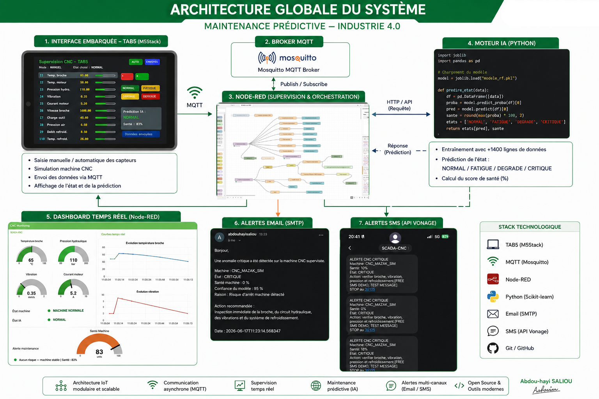

#  Maintenance Prédictive CNC — TAB5 + MQTT + Machine Learning

Système de **maintenance prédictive Industrie 4.0** simulant la supervision d'une machine CNC : un **M5Stack TAB5** publie des données capteurs en MQTT, un moteur **Python / Scikit-learn** prédit l'état de santé de la machine en temps réel, et **Node-RED** orchestre la supervision, le dashboard et les alertes Email / SMS.

> Projet pédagogique conçu pour illustrer une chaîne IoT → MQTT → IA → Supervision → Alerting de bout en bout.



---

##  Présentation

La machine CNC (réelle ou simulée) remonte 10 mesures (température broche, vibration, pression hydraulique, courant moteur, débit de refroidissement, etc.) via MQTT. Un modèle **RandomForestClassifier** entraîné sur l'historique des mesures classe l'état de la machine en 4 niveaux : `NORMAL`, `FATIGUE`, `DEGRADE`, `CRITIQUE`, avec un score de santé (%). Le résultat est renvoyé en MQTT, affiché sur le TAB5, visualisé sur un dashboard Node-RED, et déclenche des alertes Email / SMS en cas d'état critique.

---

## Flux de données

| # | Étape | Rôle |
|---|-------|------|
| 1 | **Interface embarquée (M5Stack TAB5)** | Saisie manuelle/automatique des 10 capteurs CNC, envoi MQTT, affichage de la prédiction IA reçue |
| 2 | **Broker MQTT (Mosquitto)** | Transport publish/subscribe entre le TAB5, le moteur IA et Node-RED |
| 3 | **Node-RED** | Supervision, orchestration des alertes, dashboard temps réel |
| 4 | **Moteur IA (Python)** | Reçoit les données, calcule le score de santé, prédit l'état avec le modèle ML, republie la prédiction |
| 5 | **Dashboard temps réel** | Jauges (température, pression, vibration, courant), courbes, jauge de santé machine |
| 6 | **Alertes Email (SMTP)** | Notification détaillée en cas d'anomalie critique |
| 7 | **Alertes SMS (API Vonage)** | Notification courte en cas d'anomalie critique |

```
TAB5 (capteurs) --MQTT--> Mosquitto --MQTT--> cnc_predictor.py (modèle ML)
                                                     │
                                                     ▼
                                        machine_history.csv (log)
                                                     │
                                              MQTT (prédiction)
                                                     │
                                                     ▼
                                  Node-RED (flowscada.json)
                                  ├── Dashboard temps réel
                                  ├── Alerte Email (SMTP)
                                  └── Alerte SMS (Vonage)
                                                     │
                                                     ▼
                                        TAB5 (affichage prédiction)
```

---

## Stack technique

| Composant | Technologie |
|---|---|
| Interface embarquée | M5Stack TAB5 (Arduino / M5Unified) |
| Communication | MQTT (broker public `test.mosquitto.org`) |
| Supervision / orchestration | Node-RED |
| Moteur IA | Python — Scikit-learn (RandomForestClassifier) |
| Persistance des données | CSV (`machine_history.csv`) |
| Alertes Email | SMTP (nœud Node-RED) |
| Alertes SMS | API Vonage |
| Versioning | Git / GitHub |

---

##  Structure du dépôt

| Fichier | Rôle |
|---|---|
| [`tab5.ino`](./tab5.ino) | Firmware Arduino du M5Stack TAB5 : interface tactile (10 capteurs, mode manuel/auto, presets NORMAL/FATIGUE/DEGRADE/CRITIQUE), publication MQTT (`factory/cnc/data`), abonnement et affichage de la prédiction (`factory/cnc/prediction`) |
| [`cnc_predictor.py`](./cnc_predictor.py) | Service Python qui s'abonne au topic de données, calcule le score de santé, interroge le modèle ML, republie la prédiction et journalise dans le CSV |
| [`train_model.py`](./train_model.py) | Entraînement du `RandomForestClassifier` à partir de `machine_history.csv`, évaluation (accuracy, matrice de confusion) et sauvegarde du modèle |
| [`test_model.py`](./test_model.py) | Script de test/validation du modèle entraîné sur des échantillons |
| [`analyse_machine.py`](./analyse_machine.py) | Analyse exploratoire de l'historique machine (statistiques, répartition des classes) |
| [`cnc_predictive_model.pkl`](./cnc_predictive_model.pkl) | Modèle de classification entraîné, sérialisé (joblib) |
| [`machine_history.csv`](./machine_history.csv) | Historique des mesures + prédictions, utilisé pour l'entraînement et le ré-entraînement du modèle |
| [`flowscada.json`](./flowscada.json) | Flow Node-RED à importer : dashboard SCADA, orchestration des alertes Email/SMS |

---

##  Démarrage rapide

### Prérequis

- Python 3.9+
- [Node-RED](https://nodered.org/) (avec le module `node-red-dashboard`)
- Arduino IDE ou PlatformIO, avec les bibliothèques **M5Unified** et **PubSubClient**
- Un compte sur l'API **Vonage** (alertes SMS) et un accès SMTP (alertes Email)

### 1. Cloner le dépôt

```bash
git clone https://github.com/abdouhayisaliou/maintenance-predictive-avec-tab5-mqtt-et-machine-learning.git
cd maintenance-predictive-avec-tab5-mqtt-et-machine-learning
```

### 2. Installer les dépendances Python

```bash
pip install pandas scikit-learn joblib paho-mqtt
```

### 3. (Ré)entraîner le modèle

```bash
python train_model.py
```
Génère `cnc_predictive_model.pkl` à partir de `machine_history.csv` (features : `temp`, `vibration`, `pressure`, `current`, `coolant`).

### 4. Lancer le moteur de prédiction

```bash
python cnc_predictor.py
```
Le script se connecte au broker MQTT, écoute le topic `factory/cnc/data`, et publie ses prédictions sur `factory/cnc/prediction`.

### 5. Téléverser le firmware sur le TAB5

Ouvrir `tab5.ino` dans l'Arduino IDE, renseigner votre SSID/mot de passe Wi-Fi, puis téléverser sur le M5Stack TAB5.

### 6. Importer le flow Node-RED

Dans Node-RED : menu **☰ → Import**, sélectionner `flowscada.json`, puis configurer les identifiants SMTP et Vonage dans les nœuds correspondants. Déployer le flow et ouvrir le dashboard (`/ui`).

---

## Modèle de Machine Learning

| Élément | Détail |
|---|---|
| Algorithme | `RandomForestClassifier` (150 arbres, `class_weight="balanced"`) |
| Features | température broche, vibration, pression hydraulique, courant moteur, débit de refroidissement |
| Classes prédites | `NORMAL` · `FATIGUE` · `DEGRADE` · `CRITIQUE` |
| Score de santé | calculé heuristiquement (0–100 %) à partir des écarts par rapport aux seuils nominaux |
| Sortie publiée | `prediction`, `confidence`, `health_score`, `reason`, `timestamp` (JSON) |

---

##  Topics MQTT

| Topic | Direction | Contenu |
|---|---|---|
| `factory/cnc/data` | TAB5 → moteur IA | Mesures brutes des 10 capteurs (JSON) |
| `factory/cnc/prediction` | moteur IA → TAB5 / Node-RED | État prédit, score de santé, raison |

---

##  Sécurité — pistes d'amélioration

Ce projet est à visée pédagogique ; pour un usage en production, il est recommandé de :

- Ne pas coder en dur les identifiants Wi-Fi / SMTP / Vonage dans le code source (utiliser un fichier de configuration ignoré par Git ou des variables d'environnement).
- Remplacer le broker public `test.mosquitto.org` par un broker privé avec authentification et **TLS (MQTTS)**.
- Restreindre les souscriptions/publications par ACL sur le broker.

---

##  Auteur

**Abdou-hayi Saliou** — Apprenti Ingénieur en systèmes électroniques embarqués / IoT industriel

---

## Licence

À définir par l'auteur (ex. MIT) — ajouter un fichier `LICENSE` si le projet est destiné à être réutilisé librement.
